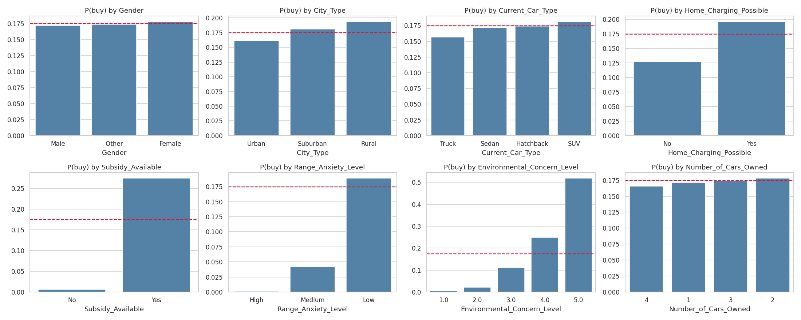
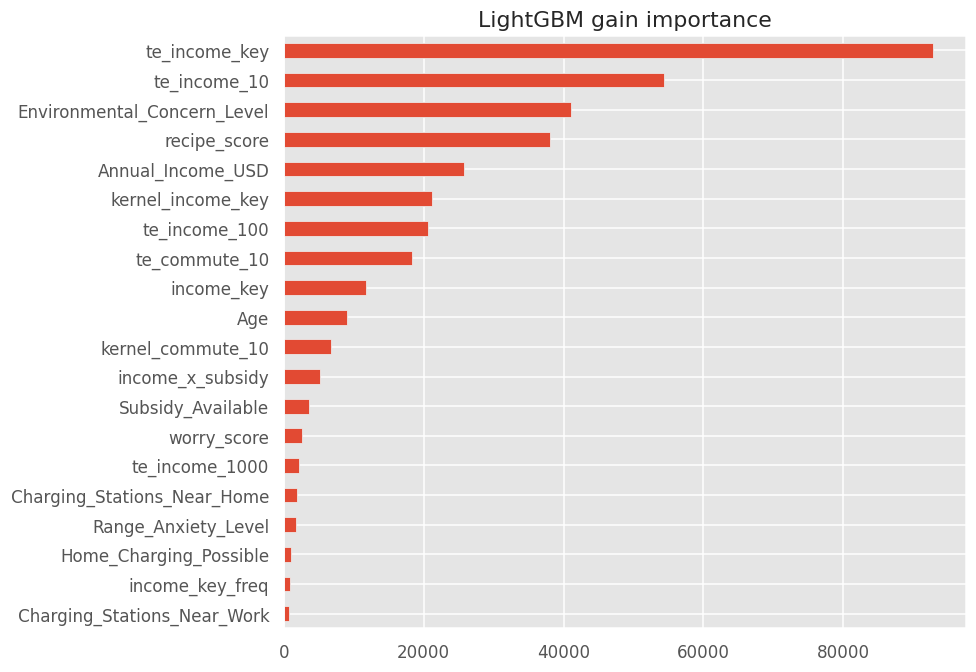

# Predicting Electric Vehicle Purchases

Solution notebooks for the Kaggle competition [Playground Series S6E9](https://www.kaggle.com/competitions/playground-series-s6e9), "Predicting Electric Vehicle Interest". Each of the 668,665 training rows describes a person through 13 attributes such as income, environmental concern, subsidy and range anxiety, and the task is to predict whether that person will buy an electric vehicle. Submissions are scored by ROC AUC on 286,571 test rows. The solution stacks LightGBM, XGBoost and a logistic regression, built on fold-safe target encoding and a score recovered from the rule behind the data, with out-of-fold predictions that other competitors published. It finished 320th of 3,575 teams on the private leaderboard (top 9%).

The three notebooks in `notebooks/` were run on Kaggle and are shown with their outputs. They rerun the submitted v6 code unchanged. Every AUC the submitted run printed reproduces to four or five decimals (the final stack's cross-validated AUC is 0.946649 here against 0.946648), while the stacker weights move by up to about 0.03, because LightGBM and XGBoost are nearly collinear (rank correlation 0.9993). Differences of this size appear between any two Kaggle machines, from LightGBM's multithreading and the tuning time limit described under Pipeline; the submitted run printed neither its trial count nor its library versions, so its exact cause cannot be pinned down.

## Results

### Leaderboard

Every version was run end to end on a Kaggle CPU session and submitted. The AUC column is the out-of-fold or cross-validated score of the submitted predictions, measured on the training rows.

| Version | What changed | CV AUC | Public AUC | Private AUC | Kaggle run time |
|---|---|---|---|---|---|
| v1 | LightGBM, XGBoost and CatBoost on 5 folds, target encoding of income keys, Optuna tuning | 0.94561 | 0.94580 | 0.94487 | 55 min |
| v2 | 10 folds, recipe score as base margin, smoothing 1, kernel-smoothed encodings, logistic regression, logistic stacker | 0.94620 | 0.94622 | 0.94527 | 114 min |
| v3 | v2 plus an MLP in the stack | 0.94620 | 0.94622 | 0.94527 | 123 min |
| v4 | v2 with LightGBM and XGBoost bagged over 3 seeds | 0.94621 | 0.94622 | 0.94527 | 162 min |
| v5, ranked | CatBoost and bagging dropped; own models stacked with public out-of-fold libraries by forward selection | 0.94645 | 0.94641 | 0.94544 | 51 min |
| v6, after the deadline | v5 plus the generator-aware ridge, logistic and XGBoost predictions of Paul Bryan Elefante | 0.94665 | 0.94669 | 0.94562 | 51 min |

What the numbers say:

- The final standing comes from v5: private AUC 0.94544, rank 320 of 3,575. v6 was submitted at 04:41 UTC on 1 October 2026, about five hours after the 23:59 UTC deadline, so Kaggle scored it (private 0.94562) but did not rank it. The notebooks here are v6.
- The private score sits 0.0009 to 0.0011 below the public score in every version. Each clear gain in cross-validated AUC (v2, v5, v6) carried over to the private score, and versions with the same cross-validated AUC scored the same, so the out-of-fold validation was a reliable guide.
- An MLP in the stack (v3) and seed bagging (v4) left the public and private scores unchanged, and CatBoost cost about an hour per run for a small stack weight, so v5 dropped all three.

### The notebooks in this repository

| Step | AUC |
|---|---|
| Recipe score alone, no model | 0.9377 |
| LightGBM, out-of-fold | 0.94617 |
| XGBoost, out-of-fold | 0.94616 |
| Logistic regression, out-of-fold | 0.94533 |
| Stack of our three models, 3-fold CV | 0.94619 |
| + generator-aware ridge (heuljax) | 0.946554 |
| + residual stack v19 (legtarrr) | 0.946609 |
| + XGBoost sample (heuljax) | 0.946637 |
| + logistic regression sample (heuljax) | 0.946644 |
| + six feature views, view B (megayak) | 0.946649 |

What the numbers say:

- The rule behind the data does most of the work: the recipe score alone reaches 0.9377 with no model, and LightGBM adds about 0.0085 on top of it.
- LightGBM and XGBoost are nearly the same model (rank correlation 0.9993); the logistic regression differs more (0.9949 with LightGBM). Stacking our three models gains only 0.00002 over LightGBM alone.
- Predictions built on other feature pipelines add 0.00046 to the stack, and the generator-aware ridge alone adds about 0.0004. It also gets the largest stacker weight (1.232), while our logistic regression gets a negative weight (-0.289) once the stronger linear models are in.
- The stack's AUC is measured with the same 3-fold cross-validation that chose its members, so it is slightly optimistic. The leaderboard is the out-of-sample check: v6, the version these notebooks rerun, scored 0.94669 public and 0.94562 private.



## What the data turned out to be

The competition data is a synthetic copy of a 10,000-row rule-based dataset. Its target follows a simple rule: a person buys when

`1.2 * income / 100000 + 0.6 * environmental concern + 2 * subsidy - 1 * medium range anxiety - 3 * high range anxiety`

plus noise is above 5.5, which gives `P(buy) = Phi(score - 5.5)`. Two more traits shape the models. Income has a floor at 30,000 that holds 9.2% of the rows, and only 13,214 distinct incomes cover 668,665 rows, so 96.5% of the rows share their exact income with at least 19 others. That repetition is what the target encoding exploits. 17.5% of the people in the training data buy an electric vehicle.

## Pipeline

```
playground-series-s6e9 (competition data, CC BY 4.0)
   |                         |
01-eda                   02-models  --> own_predictions.npz, lgb_params.json
(figures only)               |
                             |   megayak x3, legtarrr (datasets)
                             |   heuljax x3 (notebook outputs)
                             v        |
                         03-stack <---+  --> submission.csv, stack.json
```

| Notebook | What it does | Kaggle runtime |
|---|---|---|
| 01 EDA | Numeric columns, purchase rate by category, correlations, repeated incomes | under 1 minute |
| 02 Models | Recipe score, fold-safe target encoding, Optuna tuning (up to 20 trials or 600 seconds), LightGBM, XGBoost and logistic regression on 10 folds | 36 to 49 minutes (three runs) |
| 03 Stack | Our models side by side, 16 public models, forward selection, logistic stacker, submission | about 6 minutes |

Each notebook runs on Kaggle. Notebook 3 reads notebook 2's saved output as a data source: the predictions in float64 with the row ids, and it refuses to run if the ids do not match the competition files. Every notebook ran at least twice. Notebook 1 printed identical output each time, and notebook 3 printed identical output apart from elapsed times whenever it read the same predictions. Notebook 2 printed the same AUC to five decimals in all three of its runs, but not bit-identical output, for two reasons kept from the submitted code: the Optuna search stops after 20 trials or 600 seconds, so the speed of the Kaggle machine decides how many trials finish (15, 18 and 20 here, always with the same best trial), and LightGBM's multithreaded training rounds slightly differently on different machines. The SHA-256 fingerprints notebook 2 prints show that the XGBoost and logistic regression predictions were bit-identical across runs and the LightGBM predictions were not.

### Why three notebooks instead of one

The competition was worked in a single notebook. Splitting it means a change to the stacking section or to a conclusion reruns a few minutes instead of the whole hour, and each notebook reads as one argument: what the data looks like, how the models are built, how the stack is chosen. The fold tables are cheap to rebuild inside notebook 2, so the split stops at three notebooks instead of saving about 1.2 GB of fold tables between them.

## Design decisions

**The recipe score as a starting point.** The rule above was found from the data. Its score is added as a feature, and the logit of `Phi(score - 5.5)` is the base margin of LightGBM and XGBoost, so the trees learn only what the rule misses.

**Target encoding inside each fold.** Exact incomes repeat, so the purchase rate of each income value is a strong feature, but it leaks the label if a row sees itself. Training rows are encoded with an inner 5-fold split and validation and test rows with the full training part of the fold. A smoothing of 1 pulls rare values slightly towards the overall rate, and a Gaussian kernel over neighbouring values lets rare incomes borrow strength from their neighbours.

**Ten folds.** More training rows per fold made the encodings and the models a little better; v2 moved from 5 to 10 folds.

**A linear model for diversity.** LightGBM and XGBoost make almost the same mistakes. A regularised logistic regression on the recipe score, dummies, subsidy interactions and the logit of every encoding is weaker alone but sees the data differently.

**Public out-of-fold predictions and forward selection.** Several competitors published honest out-of-fold predictions from other feature pipelines. Every model is turned into a normal-score rank, and models join a logistic stacker one at a time while the 3-fold cross-validated AUC rises by more than 0.000002. An optimiser that maximised AUC directly (SLSQP) never moved from equal weights, because AUC has no gradient; the logistic stacker does.

**Printed numbers and repeated runs.** The Kaggle CLI returns only printed output and saved files, so every cell prints the numbers its conclusion relies on, and notebook 2 prints a fingerprint of every array it saves. The conclusions were written from a first run and checked against the runs that followed; they quote the values every run reproduced and leave out timings that depend on the machine. The submitted code was kept as it was, time limit included, rather than changed to make reruns bit-identical.

There is no live app: the final model stacks other competitors' predictions, which exist only for the competition's rows and cannot score a new person.



## Reproduce

1. Join the competition on Kaggle and accept its rules, then authenticate the Kaggle CLI (`kaggle auth login`; version 2.2.4 was used). On Windows, set `PYTHONUTF8=1` and `PYTHONIOENCODING=utf-8` first, or the CLI can fail on non-ASCII log text.
2. Create a Python 3.12 virtual environment and install `requirements-dev.txt`.
3. In each `notebooks/*/kernel-metadata.json`, replace `deveshupathak` in `id` (and in `kernel_sources` of `03-stack`) with your Kaggle username.
4. Push and run the notebooks in order, waiting for each to finish:
   ```bash
   python scripts/run_notebook.py push 01-eda
   ```
   `wait`, `fetch` and `compare` follow the same pattern, and `push --smoke` runs a quick check first. `fetch --pattern "(figures/.*|.*\.json|.*\.log)"` skips the 30 MB prediction file. `compare` needs two fetched runs. Notebook 3 needs notebook 2's latest run to be complete.
5. Run the tests:
   ```bash
   python -m pytest
   ```

## Repository layout

```
notebooks/   three executed Kaggle notebooks and their kernel metadata
scripts/     Kaggle notebook runner
tests/       runner tests and notebook structure checks
assets/      figures used in this README
```

## Data, public predictions and licences

No data or prediction files are stored in this repository; the notebooks read them on Kaggle, and their outputs show only five example rows of `train.csv` and the first five rows of the submission.

1. Competition data: Kaggle Playground Series S6E9, "Predicting Electric Vehicle Interest", 2026, [kaggle.com/competitions/playground-series-s6e9](https://www.kaggle.com/competitions/playground-series-s6e9). Licensed CC BY 4.0.
2. The dataset the competition data was generated from: itzzomkar, "EV Adoption Behavior and Range Anxiety", [Kaggle](https://www.kaggle.com/datasets/itzzomkar/ev-adoption-behavior-and-range-anxiety), CC0 1.0. Not read by the notebooks.
3. megayak, [S6E9 Six Feature Views OOF Library](https://www.kaggle.com/datasets/megayak/s6e9-six-feature-views-oof-library), [S6E9 hybrid LightGBM OOF](https://www.kaggle.com/datasets/megayak/s6e9-hybrid-lgbm-oof) and [S6E9 digit-leak OOF](https://www.kaggle.com/datasets/megayak/s6e9-digit-leak-oof), CC0 1.0.
4. legtarrr, [S6E9 residual stack OOF](https://www.kaggle.com/datasets/legtarrr/s6e9-residual-stack-oof), licence listed as "other".
5. Paul Bryan Elefante (heuljax), outputs of the public notebooks [Generator-Aware Ridge Logistic Regression](https://www.kaggle.com/code/heuljax/kps6e09-generator-aware-ridge-logistic-regression), [Logistic Regression Sample](https://www.kaggle.com/code/heuljax/kps6e09-logistic-regression-sample) and [XGB Sample](https://www.kaggle.com/code/heuljax/kps6e09-xgb-sample), read on Kaggle as notebook sources under the competition's rules.
